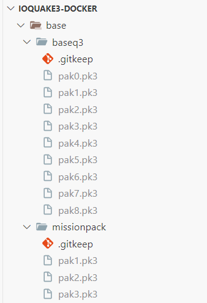

# ioquake3 docker

A docker setup for ioquake3 (The Quake III Arena source port) that actually works.

You gotta build the image yourself for now since the base paks get embedded as layers, it's kind of a nightmare to use bind mounts for those especially when the server config needs to go on top. I'll look into it later. Building it doesn't take that long, I promise.

# What do???

Put your retail Quake 3 Arena `pak0.pk3` in `base/baseq3` and the patches from [https://ioquake3.org/extras/patch-data/](https://ioquake3.org/extras/patch-data/) in `base/baseq3` and `base/missionpack`.

The structure should look like this:



Put your custom maps and mods in `content`, the compose file binds it to the user level search path so logs and junk will appear there too.

Rename `server.example.cfg` to `server.cfg`, use it for your server configuration.

Then, build the image and start the container:
```bash
docker compose up
```
